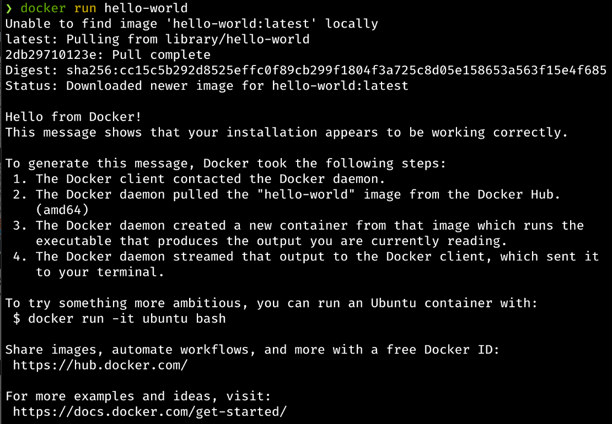

# **Executando docker containers**

Para verificar se o docker esta instalado corretamente vamos utilizar o comando:
```
# docker run hello-world
```


Quando executamos o comando docker run hello-world ocorre os seguintes processos:
* O comando “docker” irá comunicar-se com o daemon do Docker informando qual foi a ação desejada;
* O daemon vai verificar se a imagem do hello-world está presente em sua máquina, caso ela não esteja, ele irá fazer procurar a imagem e fazer o download dela no Docker Hub;
* O docker vai criar um container utilizando a imagem baixada;
* O daemon do docker envia a saída para o comando “docker” e ocorre a impressão da saída no seu terminal.
  
Observações: Foram citados dois novos itens, o daemon e o Docker Hub. Vamos ver a seguir do que se trata cada um.

</br>

______

### **Daemon e Dokcer Hub**

O _Docker daemon_ (dockerd) escuta as solicitações da Docker API e gerencia objetos Docker, como imagens, contêineres, redes e volumes. Um daemon também pode se comunicar com outros daemons para gerenciar serviços Docker.

O _Docker Hub_ é um registro do Docker hospedado gerenciado por Docker. O Docker Hub tem milhares de imagens de containers de fornecedores de software, projetos de código aberto e da comunidade. O Docker Hub contém software e aplicativos de repositórios oficiais, como NGINX, Logstash, Apache HTTP, Grafana, MySQL, Ubuntu e Oracle Linux.
Ao iniciar um contêiner, o Docker por padrão puxará automaticamente a imagem correspondente do Docker Hub público se não estiver disponível localmente. Além disso, você também pode criar suas próprias imagens e enviá-las para o Docker Hub em um repositório público ou privado.
______

Depois de verificar se esta funcionando o docker em sua maquina e entender o que é docker hub, vamos então provisionar um outro container com a imagem python. Para isso primeiro vamos ver quais as imagens disponiveis com o nome python.
```
# docker search python
```
Repare na imagem abaixo que ele trouxe todas as imagens que ele conseguiu encontrar. Atenção pois é possível identificar as imagens certificadas na coluna _Official_, ou seja, que grandes empresas fazem o suporte da imagem aplicando os devidos itens de segurança.


Para baixar a imagem basta executar o comando e ele irá trazer a ultima versão da imagem:
```
# docker pull python
```


Caso queira baixar uma versão especifica, basta adicoionar _:3.11.0a3_ por exemplo.
```
# docker pull python:3.11.0a3
```


_Obs:_ Para verificar quais versões disponiveis de imagens basta acessar o portal do docker hub, ou o registry privado com o qual esta trabalhando.

Para verificar as imagens que estão disponiveis em nossa maquina basta executar:
```
# docker images ls
```


A saída traz cinco colunas:

* _REPOSITORY_ nome da imagem.
* _TAG_ versão da imagem.
* _IMAGE ID_ identificação da imagem.
* _CREATED_ data de quando ela foi criada.
* _SIZE_ tamanho da imagem.

Com a imagem disponível em nossa maquina podemos inicia-la.
```
# docker run python echo 'Hello world!'
```


Repare que além do comando para run para executar a imagem python, temos o echo e o ‘Hello world!’, o comando está dizendo para iniciar o container e logo em seguida dar o echo na frase ‘Hello world!’.

A estrutura de um comando pode se dar por:
```
# docker container run <parâmetros> <imagem> <CMD> <argumentos>
```


Uma opção interessante do "docker ps " é o parâmetro "-a".
```
# docker ps -a
```
Com a opção "-a" você consegue visualizar não somente os containers em execução, como também containers que estão parados ou que foram finalizados.


Vamos agora iniciar um novo container com novos parâmetros.

```
# docker run -ti centos:7
```

Neste comando nos estamos querendo iniciar um containter com uma image do centos versão 7. Repare que ao executar este comando nós entraremos dentro do container apos o donwload da imagem.


Isso ocorre pois acrescentamos ao comando os parâmetros _-it_ que disponibiliza o bash do nosso container.

Agora de um _exit_ no seu bash e logo em seguida execute o comando:
```
# docker ps
```
Repare que o container foi encerrado. Imagine se é uma aplicação, ela não iria mais reponder. Para que isso não ocorra utiliza no seu comando para inicializar o container o _-d_. Este parâmetro faz com que o seu container seja executado em modo daemon ou melhor dizendo em background.

```
# docker run -d -it centos:7
```

E depos execute o comando:

```
# docker ps
```

Para poder entrar dentro do container basta utilizar o o attach.
```
# docker exec -it [CONTAINER ID] sh
```


_Obs:_ Repare que foi inserido o ID do container e esse ID para cada momento que um container é iniciado é gerado um novo, portanto verifique qual o ID da sua maquina.

Agora para para este container vamos usar o comando _stop_.
```
# docker stop [CONTAINER ID]
```
E o seu container será encerrado.

Caso deseje remover o container da sua maquina basta executar:

```
# docker rm [CONTAINER ID]
```

O docker possibilida diversos comando e combinações, para saber mais use o help do docker, e para isso basta executar o comando:

```
# docker --help
```
